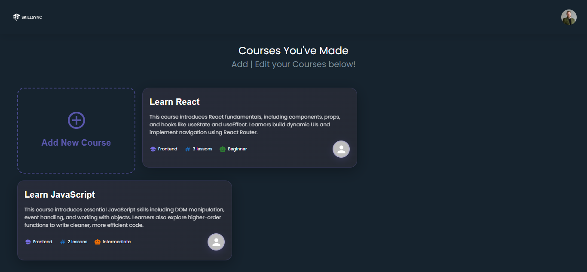
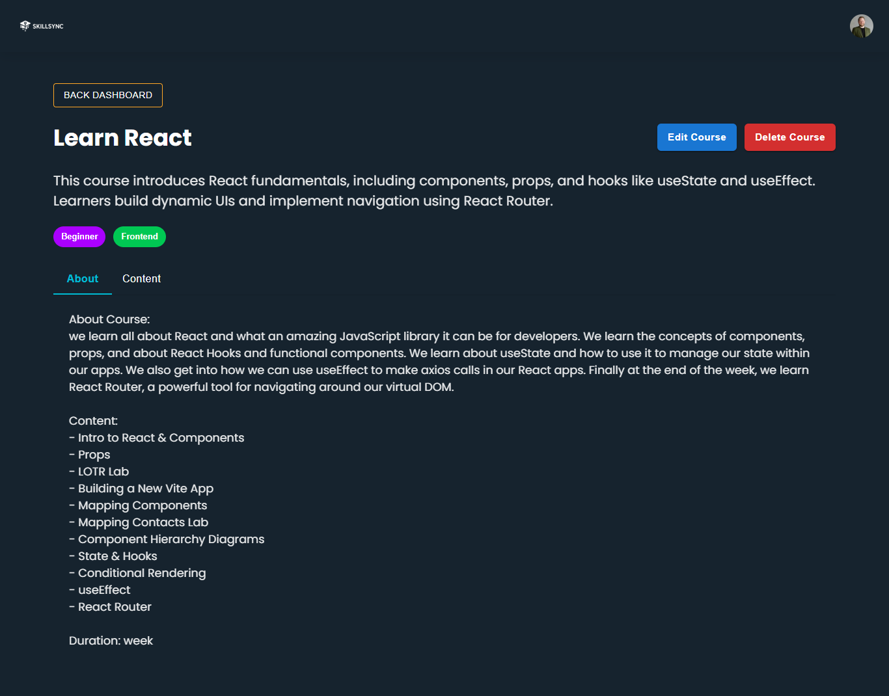
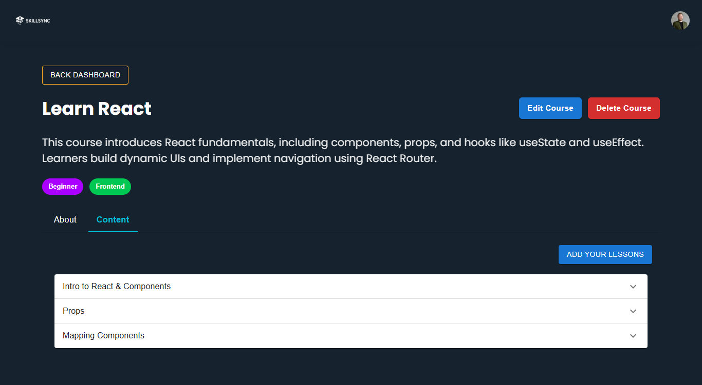
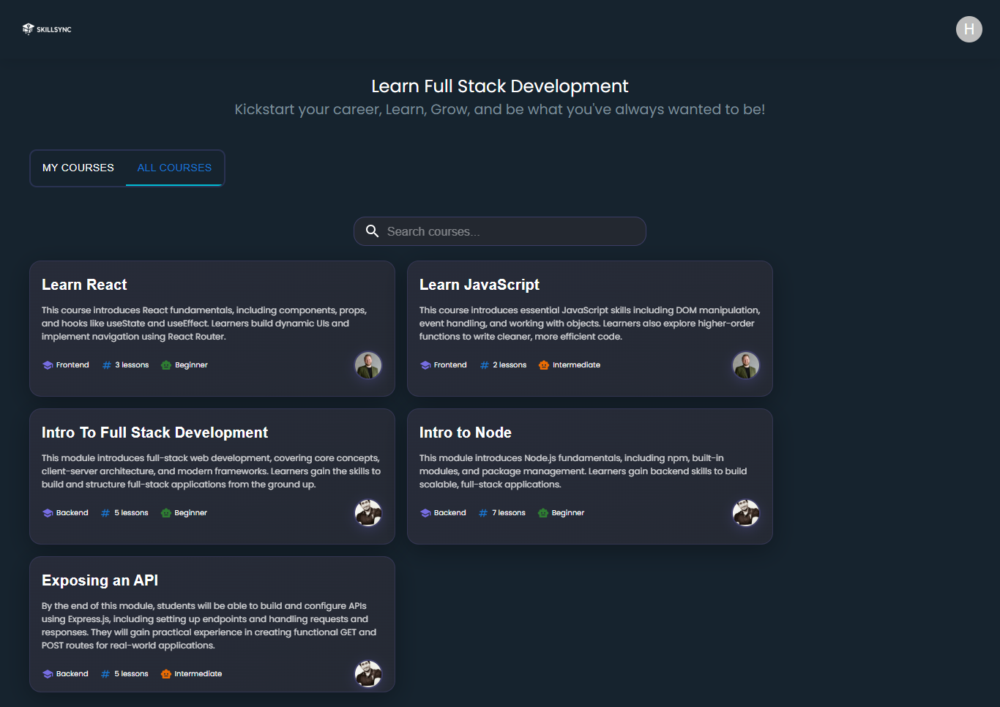
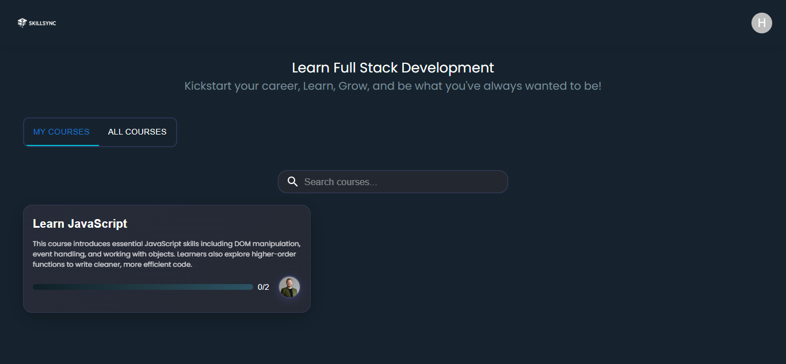
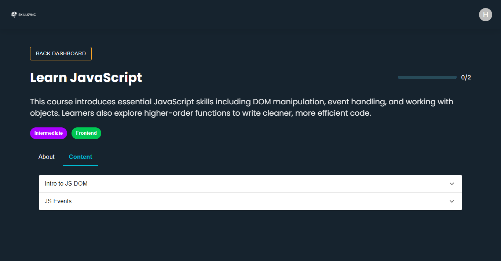

# SkillSync-Frontend
## Date: 23/10/2025
### By: Rabab Hasan, Fatima Hussain and Hasan AlDhaif
#### [Hasan AlDhaif GitHub](https://github.com/izZERO)
#### [Rabab Hasan GitHub](https://github.com/Rabab-hasan177)
#### [Fatima Hussain](https://github.com/Fatema-Abdulla)
***
### Description
platform where instructors can create and manage courses with lessons, and students can enroll, learn, and track their progress. The website features dashboards for both instructors and students, lesson pages for text content, and real-time progress tracking to enhance online learning efficiency.
### ***Technologies***
* Frontend
  * React
  * CSS
  * Material UI
  * React Bits
  * Markdown
* Backend
  * Node.js
  * Mongoose
  * Express
***
### ***Project Link***
#### [GitHub]()

### ***Trello Link***
#### [Trello](https://trello.com/b/inb6ygFH/skillsync)

***
### ***ERD***

### ***Component Hierarchy Diagram***
#### [Component Hierarchy](https://lucid.app/lucidchart/8a1c340b-10b3-4a8e-8d7a-396e8adc6162/edit?viewport_loc=5772%2C-64%2C3303%2C1398%2C0_0&invitationId=inv_5b25a192-318f-492d-add0-3c3273b5adbb)

### ***WireFrame***
.png)
.png)
.png)
.png)
.png)
.png)
.png)
.png)
.png)
.png)

### ***Website Preview***
#### Instructor dashboard

#### Instructor courses

#### Instructor lessons

#### Student dashboard

#### Student enrollment course

#### Student access to lesson

### ***Credits***
#### [Sort by specific field](https://stackoverflow.com/questions/25058007/mongodb-difference-between-orderby-and-sort)
#### [handleChange for markdown editor](https://stackoverflow.com/questions/77866041/markdown-editor-updating-state-issue-react-next-js)
