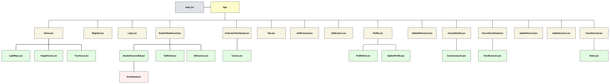

# SkillSync-Frontend
## Date: 23/10/2025
### By: Rabab Hasan, Fatima Hussain and Hasan AlDhaif
#### [Hasan AlDhaif GitHub](https://github.com/izZERO)
#### [Rabab Hasan GitHub](https://github.com/Rabab-hasan177)
#### [Fatima Hussain](https://github.com/Fatema-Abdulla)
***
### Description
platform where instructors can create and manage courses with lessons, and students can enroll, learn, and track their progress. The website features dashboards for both instructors and students, lesson pages for text content, and real-time progress tracking to enhance online learning efficiency.
### ***Technologies***
* CSS
* node.js
* HTML
* Mongoose
* express
* ejs
* Visual Studio Code
* React
***
### ***Project Link***
#### [GitHub]()

### ***Trello Link***
#### [Trello](https://trello.com/b/inb6ygFH/skillsync)

***
### ***ERD***

### ***Component Hierarchy Diagram***

### ***WireFrame***
.png)
.png)
.png)
.png)
.png)
.png)
.png)
.png)
.png)
.png)

### ***Website***

### ***Credits***
